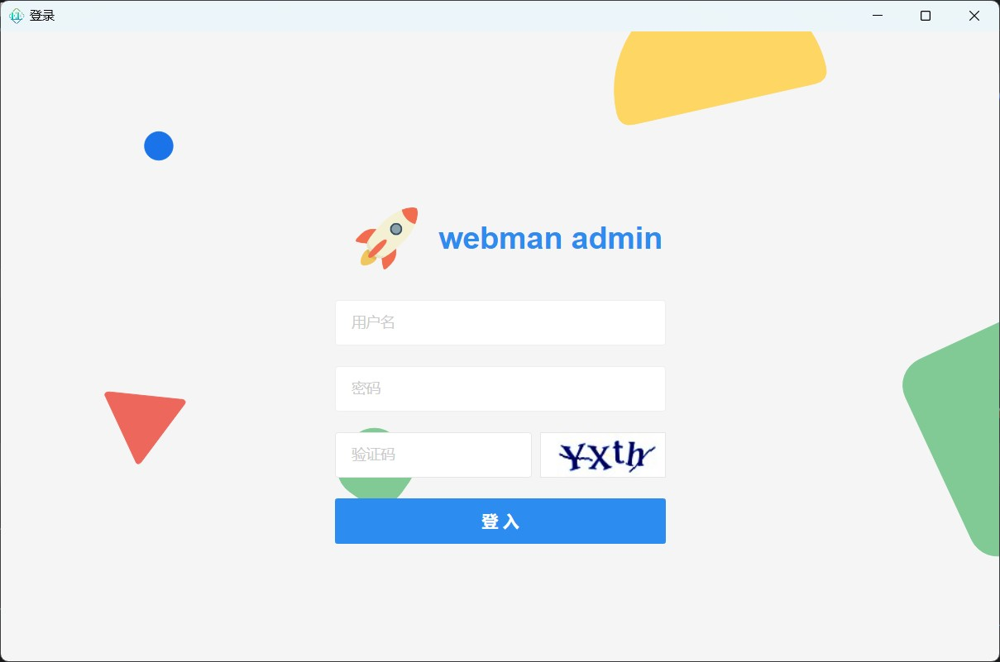

# Webman Admin Electron

## 项目说明

本项目使用 `Electron-Egg`v3.8版本为基础框架，为webman admin封装了electron的桌面版本,将webman admin的数据库改为sqlite轻量级数据库，方便软件分发部署，目前只适配于windows，但可以很方便的适配mac及linux，欢迎pr

## 第三方依赖

[Electron-Egg](https://www.kaka996.com/)
[webman-admin](https://www.workerman.net/doc/webman-admin/)

强烈建议去 `Electron-Egg` 官网阅读使用说明，右上角选择V3版本，后续有考虑升级为V4

## 📋 快速启动
> git clone https://github.com/Mr-ShiHuaYu/webman-admin-electron.git
> 
> 根目录，安装依赖
> 
> npm i
> 
> 启动
> 
> npm run dev
> 
正常会自动启动webman admin
 

用户名:admin
密码：admin


## 配置文件`setting.json`说明
```json5
{
  "openDevTools": false, // 是否打开浏览器调试工具
  "openAppMenu": false, // 是否打开应用程序顶部菜单,显示file,edit那些
  "tray": false,//是否显示拖盘，true开启，开启时，点击右上角关闭为最小化到拖盘
  "windowsOption": {
    "title": "学生管理系统xxx", // 软件顶部或左上角名称(会被 html中的 title标签覆盖)
    "width": 980,// 软件窗口宽度
    "height": 650,// 软件窗口高度
    "minWidth": 400,// 软件窗口最小宽度
    "minHeight": 300,// 软件窗口最小高度
  },
  "logger": {
    "level": "ERROR", // 日志等级，支持 info error debug warn，默认是 info
    "rotator": "day",  // day:按天切割 | none:无
    "appLogName": "app.log",// 业务日志名
    "coreLogName": "ee-core.log",// 框架核心日志名
    "errorLogName": "error.log" // 错误日志名
  },
  "webman": {
    "enable": true, // 是否开启webman，此项一定要打开
    "hostname": "localhost", // 如果enable为true,并且此项是localhost/127.0.0.1，则会根据下面的配置自动启动webman服务，如果此项是ip地址，则相当于远程访问其他服务器的webman服务
    "phpPath": "php/php80.exe", // php.exe绝对路径，确保放在 build\extraResources下,推荐使用webman官网静态php，具体版本只要和webman项目能匹配就行
    "port": 8787, // webman监听的端口，值为webman项目下的config.php中的listen的端口
    "projectPath": "webman", // webman项目目录，确保放在resources\extraResources下
    "stdioIgnore": false // 是否关闭webman进程的日志,true为关闭日志输出，false为启用日志
  }
}
```

## 目录说明
build/extraResources目录用于存放php.exe文件及webman项目

可在`build/extraResources`直接替换自己的webman admin项目，项目目录名在`setting.json`中配置

相应的php.exe可以使用php官网下载的官方版本，也可以使用静态PHP版本，也可以使用任意定制的版本，只要保证保证`php.exe windows.php`运行成功就OK.

其余目录结构说明，请查看egg官网，详情（V3)：
https://www.kaka996.com/pages/ee9aed/

## 项目原理分析
本项目原理较为简单，只是在electron-egg项目的基础上，在 `electron/addon`目录下添加了`webman`目录插件。
然后在 `electron/preload/index.js`中选择加载的插件。
webman插件主要只做2件事，启动时，运行

```shell
php.exe windows.php
```
结束时，运行

```shell
taskkill /T /F /pid ${pid}
```
> 其中，${pid}为之前启动时的进程ID

欢迎PR，FORK修改为兼容Linux和Mac版本，只要修改
`electron/addon/webman/server.js` 文件中的// todo 部分即可。

## 自带的webman项目说明
此webman 项目，是v1版本，目前还未升级v2
原来的webman admin的数据库-所有表功能是基于mysql数据库的，就是其代码生成功能是基于mysql数据库的，不适用于sqlite数据库，为了使兼容sqlite，修改了2个文件，分别是：
plugin/admin/app/common/Util.php
plugin/admin/app/controller/Crud.php
可以自行对比修改了什么内容

建议在mysql上开发好后，使用navicat的数据库迁移工具，将mysql数据库转为sqlite数据库，然后，关闭代码生成等功能


## 打包
我一般使用 `npm run build-wz`来构建7z压缩包，免安装版本
重新运行打包命令会删除旧文件
> 相关配置文件位于 electron/config/builder.json
> 
```
# 准备，设置国内镜像
# 如果第一次构建长时间卡住，尝试删除 C:\Users\本机用户名\AppData\Local\electron\Cache 把这个目录清空，并重试

# 打包 （windows版）
npm run build-w
npm run build-w-32 (32位)
npm run build-w-64 (64位)
npm run build-w-arm64 (arm64)

# 打包 （windows 免安装版）
# ee > v2.2.1
npm run build-wz
npm run build-wz-32 (32位)
npm run build-wz-64 (64位)
npm run build-wz-arm64 (arm64)

# 打包 （mac版,待添加）
npm run build-m
npm run build-m-arm64 (m1芯片架构)

# 打包 （linux版,待添加）
# ee > v2.2.1
npm run build-l (32位 deb包)
npm run build-l-64 (64位 deb包)
npm run build-l-arm64 (64位 deb包 arm64)
npm run build-l-armv7l (64位 deb包 armv7l)
npm run build-lr-64 (64位 rpm包)
npm run build-lp-64 (64位 pacman包)
```
## 打包后程序位置
```
# 程序
目录：electron-egg/out
Windows安装包：out/webman-admin-electron-win-0.0.1-x64.exe  
Windows免安装包：out/webman-admin-electron-win-0.0.1-x64.7z
Mac软件包：out/xxxx.dmg
Linux软件包：out/xxx.deb 
```

# 兼容window 7 系统
微软已经停止对 win7系统支持。需要支持win7的，请使用以下开发环境
```
electron <= 22版本
node.js <= 16版本
electron-builder <= 23.6.0

```

## TODO
- [ ] 升级egg为v4
- [ ] 升级webman admin为v2版本，以支持协程
- [ ] 添加go语言的示例
- [ ] 兼容sqlite，添加代码生成功能

## 欢迎PR
